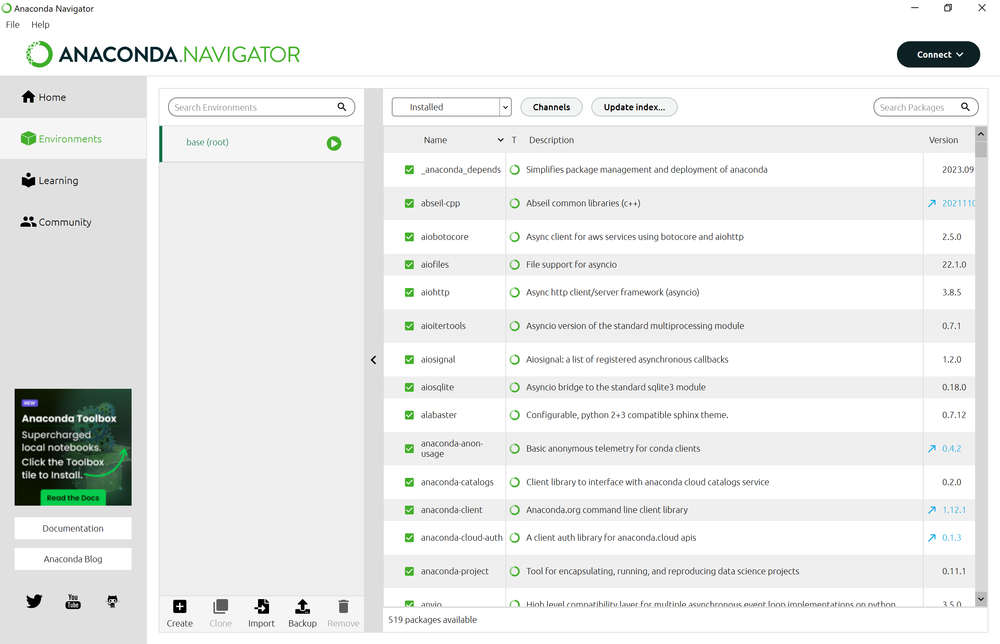
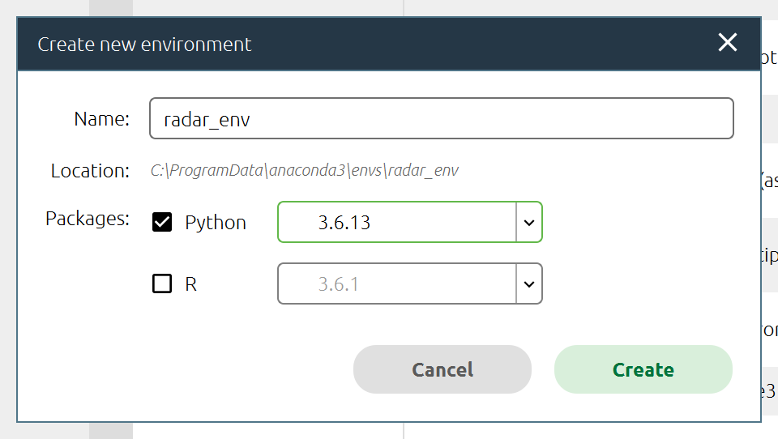
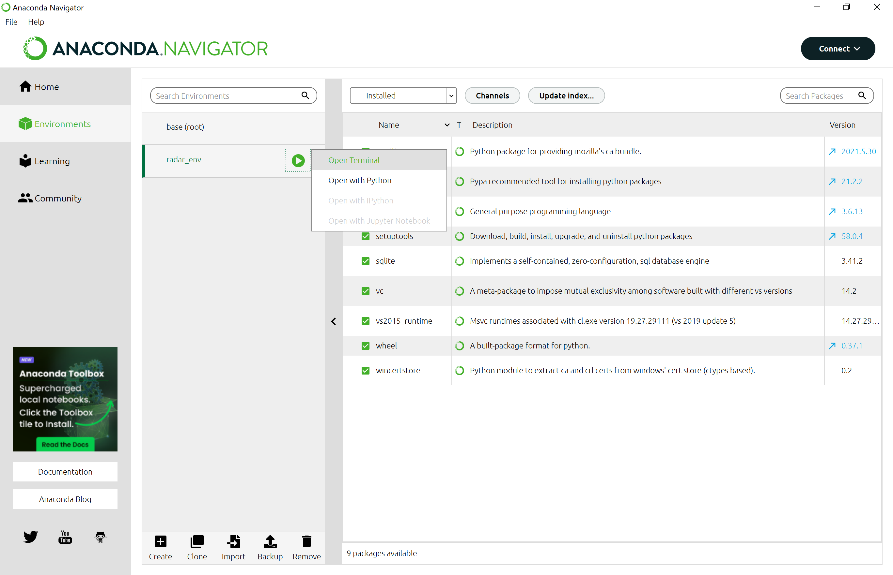
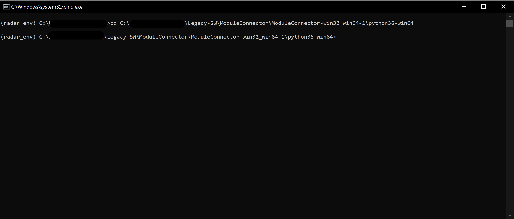

# Processing of respiratory signals detected by a radar sensor

This repository contains the source code for my thesis of signal processing from a radar system.

## Hardver

For this project I used a Novelda X4M200 radar sensor. The whole code and signal processing was tested on this device.

## Install

This sensor using Python 2.7 or 3.6 versions, thus if you haven't already, we need to create an evinronment for it, if you want to use other Python versions.

### Anaconda Navigator

In this chapter I cover the basics of the installation of my software and all of its requirements.

For this purpose I used Anaconda Navigator, but you can use any virtual environment meneger system. 
https://www.anaconda.com/download

After the installation, You have to create a new environment. Navgite to the environments menu, hit the create button on the bottom of the window. 

A new windows will appear, here give it name, something like "radar_env", and chose Python 3.6.13 for the package. Hit create. Wait for the process to finish.

### Module Connector

In this environment we need to install a few requirements. First of all, the driver for the radar sensor. This is available from the Novelda Github page. 
https://github.com/novelda/Legacy-SW

Download this folder. After that, in Anaconda Environments menu, click on your new environment. Wait for the load to finish, and click the little play button, and select "Open in terminal". 

In the command prompt change the directory to where you put your Legcy-SW folder. More precicely to the ModuleConnector folder, and pick your OS's folder, and your Python version folder. In my example it will be: 

C:\ ... \Legacy-SW\ModuleConnector\ModuleConnector-win32_win64-1\python36-win64

We need to install some dependencies. For that, run the following command: `python -m pip install -r requirements.txt`

We're all set. From this just connect the radar and you're good to go.

## Usage

To use the program enter one of the following commands:

### Real time data collection and plot
`python main.py --method run_realtime --area_end 3 --sample_time 60`

### Data collection without plot
`python main.py --method run_radar --area_end 3 --sample_time 60`

### Evaluate the saved data
`python main.py --method perform_fft_analysis --folder “folder name”`

You can use the `help` function to get additional information. Adding the area_end, and the sample_time is optional. The default save location will be a folder inside the project called "measures".